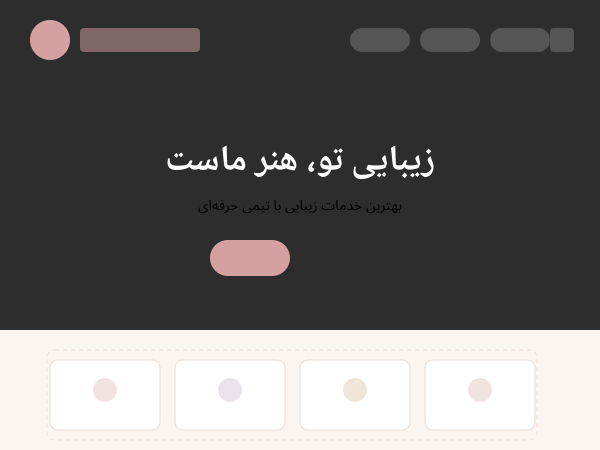

<p align="center">
  
</p>

<h1 align="center">Rozholy</h1>

<p align="center">
  <strong>A Premium WordPress Block Theme for Beauty Salons & Spas</strong>
</p>

<p align="center">
  <a href="https://wordpress.org/"></a>
  <a href="https://woocommerce.com/"></a>
  <a href="LICENSE"></a>
  <a href="https://www.php.net/releases/7_4_0.php"></a>
  <br>
  
  
  
</p>

---

## Overview

**Rozholy** is a professional, modern, and fully responsive WordPress **Full Site Editing (FSE) block theme** built specifically for **beauty salons, hair studios, spas, skincare clinics, and wellness businesses**. It features a feminine color palette (rose, gold, violet), Persian/RTL support, and deep WooCommerce integration.

### Why Rozholy?

- ✅ **Full Site Editing (FSE)** — edit everything visually via the Site Editor
- ✅ **WooCommerce Ready** — sell products with a custom-styled storefront
- ✅ **Block Patterns** — hero, services grid, testimonials, gallery, booking form
- ✅ **Persian / RTL Support** — native right-to-left layout
- ✅ **User Dashboard** — profile editing, password change, activity log
- ✅ **Customizer Settings** — colors, header layout, social links, footer text
- ✅ **Style Variations** — Default, Dark, Rose Gold
- ✅ **Child Theme Ready** — `rozholy-child` included for safe customization

---

## Features

### Design & Appearance
| Feature | Description |
|---------|-------------|
| **Feminine Color Palette** | Rose, gold, and warm neutral tones |
| **Custom Typography** | Playfair Display + Vazirmatn with Google Fonts |
| **Smooth Animations** | Entrance, hover, and scroll effects |
| **Transparent Header** | Optional overlay header for hero sections |
| **Wavy Footer** | Modern 4-column footer with social icons |
| **Fully Responsive** | Optimized for mobile, tablet, and desktop |

### Plugin Compatibility
| Plugin | Status |
|--------|--------|
| **WooCommerce** | Full support with custom templates |
| **Rozholy Companion** | Booking manager + custom blocks |
| **Yoast SEO** | Fully compatible |

### Technical Features
- **9 FSE templates**: index, front-page, page, single, archive, 404, search
- **6 block patterns**: hero, services, testimonials, gallery, booking, contact
- **3 style variations**: default, dark, rose-gold
- **User dashboard**: profile editing, password change, activity log with AJAX load-more
- **Customizer**: primary/secondary color, header layout, social links, footer text
- **Security hardening**: version removal, XML-RPC disabled, login errors unified, REST API user endpoint protected
- **WooCommerce**: custom wrapper, mini-cart fragments, product grid

---

## Installation

### Via FTP
```bash
cp -r rozholy /path/to/wp-content/themes/
```

Then activate from **Appearance > Themes**.

### Via WordPress Admin
1. Go to **Appearance > Themes > Add New**
2. Click **Upload Theme**
3. Select `rozholy.zip` and install
4. **Activate** the theme

---

## Quick Setup

### 1. Customize Colors
Go to **Appearance > Customize > Rozholy Settings > Colors** to set your brand colors.

### 2. Set Up Menus
**Appearance > Menus** — create a menu and assign it to the "Primary Menu" location.

### 3. Configure Social Links
**Appearance > Customize > Rozholy Settings > Social Links** — add Instagram, Telegram, WhatsApp, YouTube URLs.

### 4. Set Up Dashboard Page
1. Create a new page with the **Dashboard** template
2. Go to **Appearance > Customize > Rozholy Settings > User Dashboard**
3. Select the dashboard page

### 5. (Optional) Install Companion Plugin
Install [Rozholy Companion](https://github.com/Hordekiller/rozholy-companion) for:
- Booking management with React admin UI
- Custom Gutenberg blocks (Service Card, Testimonial)
- Booking REST API

---

## File Structure

```
rozholy/
├── style.css                       # Theme stylesheet
├── theme.json                      # FSE design tokens
├── functions.php                   # Theme bootstrap (loads inc/*)
├── index.php                       # FSE fallback
├── screenshot.png                  # Theme preview (1200×900)
├── page-dashboard.php              # User dashboard template
├── inc/
│   ├── setup.php                   # Theme support & features
│   ├── enqueue.php                 # Scripts & styles
│   ├── customizer.php              # Customizer settings
│   ├── template-functions.php      # Helper functions
│   ├── security.php                # Hardening filters
│   ├── woocommerce.php             # WooCommerce overrides
│   └── dashboard.php               # Dashboard handlers
├── templates/                      # FSE block templates
├── parts/                          # FSE template parts
├── patterns/                       # Block patterns (PHP)
├── styles/                         # Style variations
├── template-parts/dashboard/       # Dashboard partials
├── woocommerce/                    # WC template overrides
├── assets/
│   ├── css/
│   ├── js/
│   ├── fonts/
│   └── images/
└── languages/
```

---

## Development

Requires WordPress 6.5+ and PHP 7.4+.

```bash
# Clone the repo
git clone https://github.com/Hordekiller/rozholy.git

# For child theme customizations, use rozholy-child/
```

---

## Contributing

Contributions are welcome!

- 🐛 **Report bugs**: [Open an Issue](https://github.com/Hordekiller/rozholy/issues/new)
- 💡 **Suggest features**: Start a Discussion
- 🔧 **Submit code**: Open a Pull Request

---

## License

GNU General Public License v2.0 or later. See [LICENSE](LICENSE).

```
Rozholy WordPress Theme
Copyright (C) 2025 ThemeFire

This program is free software; you can redistribute it and/or
modify it under the terms of the GNU General Public License
as published by the Free Software Foundation; either version 2
of the License, or (at your option) any later version.
```

---

## Author

**ThemeFire** — built for the WordPress community

- 🌐 [themefire.dev](https://themefire.dev)
- 📧 hello@themefire.dev

---

<p align="center">
  <strong>Rozholy — Elevate your beauty salon's online presence. 🌹</strong>
</p>
